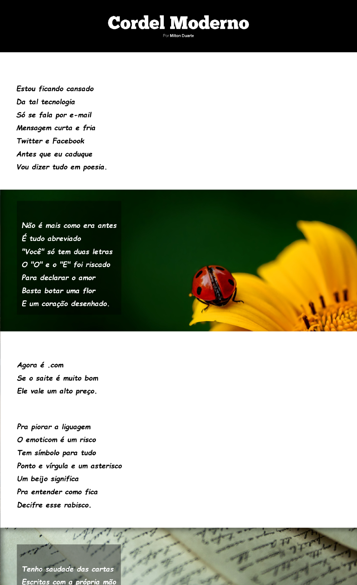

# 📜 Cordel Moderno

Projeto desenvolvido como parte do curso de **HTML5 e CSS3** do [CursoemVideo](https://www.youtube.com/watch?v=ofFgnDtn_1c&list=PLHz_AreHm4dmcAviDwiGgHbeEJToxbOpZ&index=1), ministrado pelo professor Gustavo Guanabara. O site apresenta o poema "Cordel Moderno" de Milton Duarte, explorando técnicas de design para web.

## 🔗 Demonstração
Você pode visualizar o projeto online aqui: **[Projeto Android](https://anaClarissi.github.io/cordel-moderno/)**

## 🚀 Tecnologias Utilizadas

* **HTML5:** Estruturação semântica de conteúdo.
* **CSS3:** Estilização avançada, uso de variáveis (`:root`) e fontes personalizadas.
* **Design Responsivo:** Aplicação de unidades relativas como `vw` para garantir uma boa experiência em diferentes tamanhos de tela.

## 🛠️ Funcionalidades e Conceitos Aplicados

* **Efeito Parallax:** Uso de `background-attachment: fixed` para criar o efeito de profundidade nas imagens de fundo durante a rolagem.
* **Modularização de CSS:** Organização do código através de múltiplos arquivos CSS importados via `@import`.
* **Tipografia Customizada:** Uso de `@font-face` para carregar fontes locais que remetem à literatura de cordel.
* **Interatividade:** Links com efeitos de transição e estados de hover.

## 🖋️ Autor do Poema
O texto utilizado pertence a **Milton Duarte**, um belíssimo cordel que contrasta a tecnologia atual com a tradição da escrita manual e da poesia.

## 👩‍💻 Desenvolvedora
* **Ana Clarissi** - [Meu Linkedin](https://www.linkedin.com/in/anaclarissi/)

---
